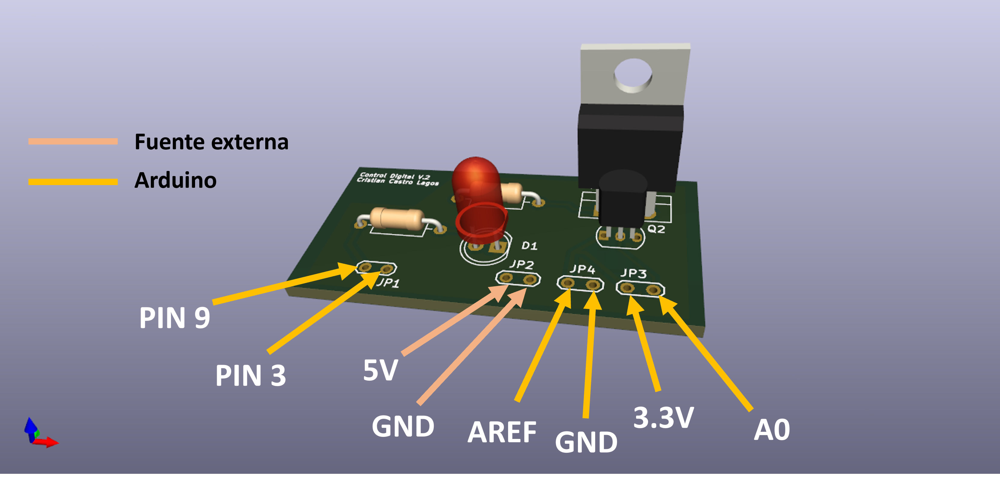

# 🚀 Modulo control de temperatura

## 📖 Descripción
Se desarrolla y construye un módulo de bajo costo para realizar experiencias practicas de control digital. El control del sistema se realizo usando Arduino y la temperatura se midió usando un TMP36.

## 📂 Contenido
- `/Hardware` → esquemático, PCB, Gerbers.
- `/control_temp_LC` → código en C para Arduino.
- `/docs` → fotos.

# 🔄 Lazo de Control

## 🖼️ Render 3D PCB

---

## ⚡ Prototipo físico

## 📜 Licencias
- Firmware → MIT License  
