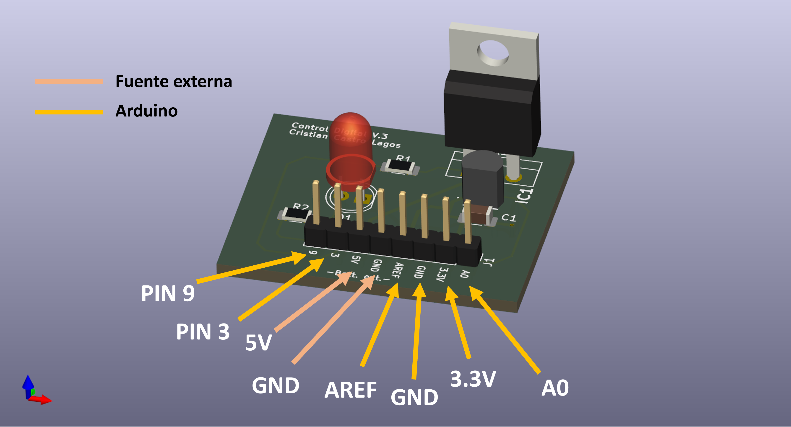

# 🚀 Temperature Control Module

## 📖 Overview
This low-cost module was designed and built to perform hands-on experiments in Digital Control. The system is controlled using an Arduino Leonardo, heat is modulated with a TIP31C transistor, and temperature is measured using a TMP36 sensor.  

It provides a simple and practical platform for learning control theory in a laboratory environment.

> ⚠️ **Note:** This project is currently under updates. Features and hardware are subject to change.

## 📂 Contents
- `/Hardware` → schematic, PCB, Gerbers.
- `/control_temp_LC` → C code for Arduino.
- `/docs` → photos

## 📊 Project Status

| Component | Status |
|------------|--------|
| Temperature Sensor Interface | ✅ Completed |
| Signal Filtering and Smoothing | ✅ Completed |
| PID Control Implementation | ✅ Completed |
| Migration from MATLAB Data Logging to Processing 4 GUI | ✅ Completed |
| Data Storage and CSV Export | ✅ Completed  |
| Processing 4 GUI (Monitoring & Logging) | ⚙️ In Progress |
|  PCB Design with Improved Measurement Stability  | ⚙️ In Progress |

> 💻 The project now features a Processing 4 graphical interface that replaces the previous MATLAB-based monitoring, data recording and data logging system.  
> 🔧 This new GUI allows real-time temperature monitoring and data recording, alongside the ongoing development of a custom PCB to improve measurement stability and reduce signal noise.

## ⚙️ System Description
- **Controller:** Arduino Leonardo or Mega  
- **Sensor:** TMP36 analog temperature sensor  
- **Actuator:** TIP31C transistor controlling a heating element  
- **Control Strategy:** Digital PI temperature regulation  
- **Sampling period:** 0.1 seconds  
- **Data transmission:** Serial communication for data logging and Processing 4 GUI monitoring  
- **PCB:** Custom-designed board for power and measurement stability  

## 🔄 Control Loop

### Controlled Variables
- **Temperature** → Temperature value control (stabilization)

## 📐 Digital PID Control

The Module uses a discrete PI controller implemented on a Arduino microcontroller.  
The control law in the digital domain is expressed as:

$$
u(n) = u(n-1) + K_0 e(n) + K_1 e(n-1)
$$

Digital PI controller implemented for temperature measured,

$$
V_{PWM}(n) = V_{PWM}(n-1) + K_0 e(n) + K_1 e(n-1)
$$

### Parameters:
The parameters are adjusted for temperature measured,

$$
K_0 = K_p + \frac{K_p}{2T_i} T_s
$$

$$
K_1 = -K_p + \frac{K_p}{2T_i} T_s
$$

## 🔉 Signal Processing: Low-Pass IIR Filter (1st Order)

To reduce measurement noise, a **first-order IIR low-pass filter** was applied to the temperature signal before feeding it to the controller and the ARX model.  

### 🔹 Filter Equation  

$$
y(k) = \alpha \cdot x(k) + (1 - \alpha) \cdot y(k-1)
$$  

Where:  
- $$x(k)$$: raw sensor measurement at time step $$k$$  
- $$y(k)$$: filtered output  
- $$\alpha$$: smoothing factor, $$(0<\alpha<1)$$ 

## 🧪 PI Control Test and ARX Model Comparison  

A test was performed using a **PI controller** applied to the temperature control module.  
The experimental results were compared against a **linear ARX model** identified from system data.  

### 🔹 General ARX Model Equation  

The ARX (Auto-Regressive with eXogenous input) model is defined as:  

$$
y(k) + a_1 y(k-1) + a_2 y(k-2) + \dots + a_{n_a} y(k-n_a) =
b_1 u(k-1) + b_2 u(k-2) + \dots + b_{n_b} u(k-n_b) + e(k)
$$  

Where:  
- $$y(k)$$: system output at sample $$k$$ 
- $$u(k)$$: input signal at sample $$k$$  
- $$( a_i, b_j)$$: ARX parameters  
- $$( n_a, n_b)$$: model orders  
- $$e(k) $$: disturbance/noise  

### 🔹 Results Overview  
- ✅ The PI controller improved **temperature tracking** and reduced overshoot.  
- 📉 The ARX model captured the main dynamics, with small discrepancies due to nonlinear heat transfer effects.  
- ⚖️ The comparison confirms the applicability of ARX models for **thermal system control design**.  

### 🔹 Experimental Plots  

## 🖥️ GUI — Monitoring and Data Logging

The graphical user interface (GUI) shown in the photograph is developed using **Processing 4**.  
It is designed **only for monitoring** the temperature module in real time and for **recording experimental data**.  

Key features:
- Real-time plot of temperature and setpoint.
- Display of control output (PWM or equivalent).
- Logging of measurements to files for offline analysis.
- Simple visualization of system behavior during experiments.

> ⚠️ **Note:** The GUI is for observation and data recording only; it does **not** modify the control system or send commands to the hardware.

> ⚠️ **Status:** Work In Progress — the GUI is being actively developed and will be added to the repository once sufficiently stable.

## 🖼️ Render 3D PCB 

<table>
  <tr>
    <td align="center">
       
      PCB Render - Version 2
    </td>
    <td align="center">
       
      PCB Render - Version 3 - Next update 
    </td>
  </tr>
</table>

## ⚡ Physical Prototype

<table>
  <tr>
    <td align="center">
       
      Device connections
    </td>
    <td align="center">
       
      Complete setup
    </td>
  </tr>
</table>

## 📜 License
MIT License  
